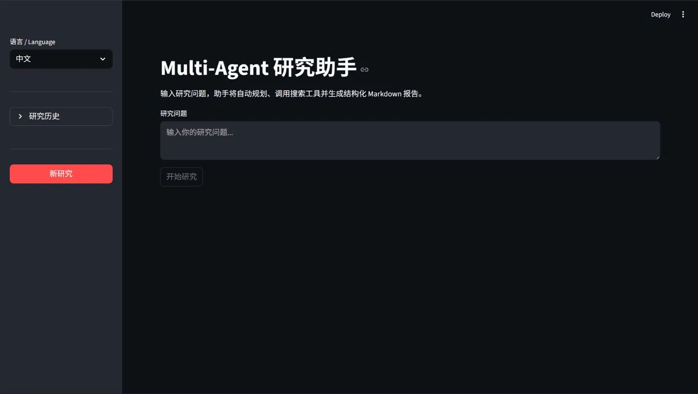
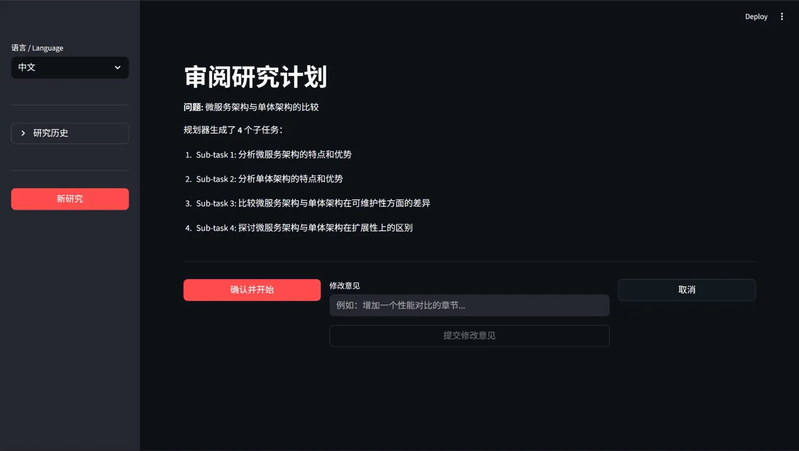
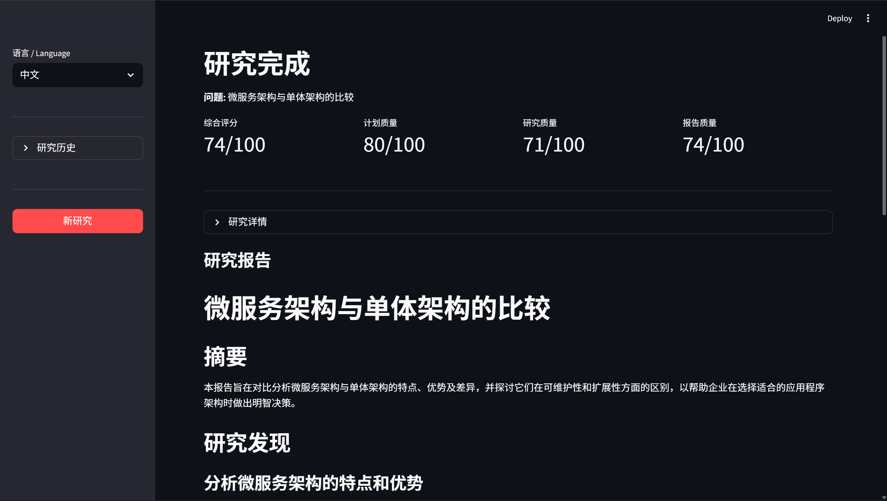

[English Version](README_EN.md)

# Multi-Agent Research Assistant

多个 AI Agent 协作完成研究任务——自动拆解问题、搜索信息、生成结构化报告。


---

## Demo





典型使用流程：

1. 在 Streamlit 页面输入研究问题，例如「量子计算对密码学的影响」
2. Planner 将问题拆解为 3-5 个子任务，展示计划供审阅
3. 用户确认或修改计划后，Researcher 逐一执行，调用 DuckDuckGo 和 Wikipedia 搜索
4. 所有子任务完成后，Writer 汇总为带引用的 Markdown 报告
5. 历史会话自动存入 SQLite，下次可继续追问

---

## 架构

```
用户问题
   │
   ▼
┌─────────────┐
│   Planner   │  将问题拆解为 3-5 个子任务
└──────┬──────┘
       │ 生成计划
       ▼
┌─────────────┐   需要修改？   ┌──────────────┐
│ Human Review│ ◀────────────▶ │   Replan     │
└──────┬──────┘                └──────────────┘
       │ 确认
       ▼
┌─────────────────────────────────────────────┐
│              Researcher Agent               │
│                                             │
│  子任务 1 → [ReAct 循环] → 结果             │
│  子任务 2 → [ReAct 循环] → 结果             │  ← 失败自动重试（最多 3 次）
│  子任务 N → [ReAct 循环] → 结果             │
│                                             │
│  Tools: DuckDuckGo Search | Wikipedia       │
└──────────────────┬──────────────────────────┘
                   │ 所有任务完成
                   ▼
           ┌──────────────┐
           │    Writer    │  汇总发现 → Markdown 报告
           └──────────────┘
```

**Planner**：调用 LLM 将研究问题分解为具体、可执行的子任务，保证覆盖多个维度。

**Human Review / Replan**：计划生成后暂停，让用户确认或给出修改意见；支持多轮修改直到满意。

**Researcher**：基于手写 ReAct 循环逐任务执行，调用搜索工具收集信息，自带三次错误重试。

**Writer**：整合所有子任务结果，生成带章节、引用和局限性说明的结构化 Markdown 报告。

---

## 核心功能

- **Multi-Agent 编排**：LangGraph 状态图管理完整工作流，节点间状态共享
- **Human-in-the-Loop**：执行前人工审阅计划，支持多轮修改
- **真实工具调用**：DuckDuckGo 网络搜索 + Wikipedia，ReAct 循环手写实现（兼容小模型）
- **错误恢复**：子任务失败自动重试，超限后 graceful degradation，报告中标注失败原因
- **长期记忆**：SQLite 持久化会话历史，CLI 支持 `--history` / `--search` 查询
- **评估框架**：计划质量、研究深度、报告完整性三维度自动评分，零外部依赖

---

## 技术栈

| 组件 | 技术 | 用途 |
|------|------|------|
| Agent 编排 | LangGraph 0.2+ | 状态图、节点路由、循环控制 |
| LLM 调用 | LangChain + langchain-openai | 统一 LLM 接口 |
| 本地 LLM | Ollama + qwen2.5:7b | 推理引擎，完全本地运行 |
| 网络搜索 | DuckDuckGo (ddgs) | 实时搜索工具 |
| 百科搜索 | Wikipedia | 结构化知识来源 |
| 数据持久化 | SQLite | 会话记忆存储 |
| 前端 | Streamlit 1.35+ | Web 交互界面 |
| 容器化 | Docker + Compose | 一键部署 |
| 测试 | pytest | 76 个测试，全部通过 |

---

## 快速开始

### 前置条件

- Git
- **方式 A（Docker）**：Docker Desktop
- **方式 B（本地）**：Python 3.11+、[Ollama](https://ollama.com)

---

### A. Docker（推荐）

```bash
git clone https://github.com/GuddXzy/multi-agent-research.git
cd multi-agent-research

# 启动所有服务（后台运行）
docker compose up -d

# 拉取模型（首次约 2GB，后续跳过）
bash scripts/init_ollama.sh
```

打开浏览器访问 http://localhost:8501

> **无 NVIDIA GPU？** 删除 `docker-compose.yml` 中的 `deploy` 段即可，改用 CPU 运行。

---

### B. 本地运行

```bash
git clone https://github.com/GuddXzy/multi-agent-research.git
cd multi-agent-research

pip install -r requirements.txt

# 拉取并启动本地模型
ollama pull qwen2.5:7b
ollama serve

# 启动 Web 界面
streamlit run app.py

# 或使用 CLI
python main.py "量子计算对密码学的影响"
```

---

## 项目结构

```
multi-agent-research/
├── app.py                  # Streamlit 前端入口
├── main.py                 # CLI 入口
├── eval_runner.py          # 评估脚本
├── Dockerfile
├── docker-compose.yml
├── scripts/
│   └── init_ollama.sh      # 模型初始化脚本
├── src/
│   ├── config.py           # 全局配置（LLM、路径、重试参数）
│   ├── state.py            # AgentState 类型定义
│   ├── graph.py            # LangGraph 状态图
│   ├── memory.py           # SQLite 会话记忆
│   ├── evaluation.py       # 评估框架
│   ├── agents/
│   │   ├── planner.py
│   │   ├── researcher.py
│   │   ├── writer.py
│   │   ├── human_review.py
│   │   └── replan.py
│   └── tools/
│       ├── web_search.py
│       ├── wikipedia.py
│       └── text_tools.py
└── tests/                  # 74 个单元 / 集成测试
```

---

## 评估框架

运行 `python eval_runner.py` 对研究流程进行自动评分，三个维度：

| 维度 | 评估内容 |
|------|---------|
| **计划质量** | 子任务数量是否合理、覆盖是否全面、问题是否具体可执行 |
| **研究深度** | 每个子任务的信息量、工具调用次数、结果完整性 |
| **报告完整性** | 章节结构、引用来源、局限性说明、字数覆盖 |

评分逻辑为纯确定性 Python，不依赖 LLM 判断，结果稳定可复现。

---

## Roadmap

- [x] LangGraph 多 Agent 状态图
- [x] Human-in-the-Loop 计划审阅
- [x] ReAct 工具调用（DuckDuckGo + Wikipedia）
- [x] 错误恢复与重试机制
- [x] SQLite 长期记忆
- [x] 评估框架
- [x] Streamlit Web 界面
- [x] Docker 一键部署
- [ ] 并行子任务执行（提速）
- [ ] 更多工具接入（arXiv、GitHub、News API）
- [ ] RAG 增强（向量检索历史报告）
- [ ] 多模型支持（GPT-4、Claude、Gemini 等云端模型切换）

---

## License

[MIT](LICENSE)
